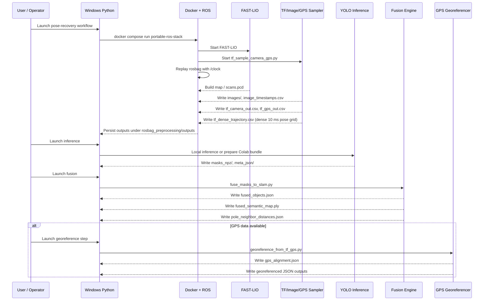

# System Overview

[Back to index](README.md) | [Next: ROS Bag Preprocessing](02-rosbag-preprocessing.md)

## Purpose

The backend exists to turn utility-inspection rosbags into portable artifacts
that downstream tools can analyze and visualize. The final outputs can include:

- a SLAM point cloud,
- time-aligned image exports,
- MATLAB-generated wire extraction artifacts,
- semantic object detections projected into 3D,
- pole spacing metadata,
- GPS-tagged fused object JSON,
- GPS-tagged powerline overlay JSON.

## Runtime Domains

The pipeline is intentionally split across runtime domains:

1. Windows Python orchestration
2. Dockerized ROS preprocessing
3. Optional Colab inference
4. Native Windows C++ accelerators

This split is deliberate. ROS and FAST-LIO are easier to preserve in a Linux
runtime, while Fusion, Open3D, and local YOLO inference fit naturally on the
Windows Python side.

The experimental GUI integration adds one more practical layer on top:

5. Windows Qt dashboard orchestration

That layer lives primarily in:

- `main.py`
- `testDashboard.py`
- `gui_pipeline.py`
- `scan_metadata.py`
- `Matlab_ExtractPowerLine/testSemanticLidarViewer.py`

It does not replace the backend contracts. It consumes them.

In the current experimental branch, this GUI layer can actively launch:

- pose recovery / SLAM
- wire extraction
- fusion
- semantic viewer loading
- Leaflet map loading

It still treats FLAI as an external/manual stage.

## End-To-End Flow

## Core Architecture Decisions

### File contracts over hidden state

Every stage writes explicit artifacts for the next stage. Examples:

- pose recovery writes `images/`, `image_timestamps.csv`, `tf_camera_out.csv`,
  `tf_gps_out.csv`, `tf_dense_trajectory.csv`, and `pcd/scans.pcd`
- inference writes `masks_npz/` and `meta_json/`
- fusion writes `fused_objects.json` and `pole_neighbor_distances.json`
- georeferencing writes `gps_alignment.json` and georeferenced JSON copies

This makes stages rerunnable and easier to debug in isolation.

### Mounted outputs for portability

User-visible outputs are written into mounted repo folders, not ephemeral
container paths. That is why `rosbag_preprocessing/outputs/` is so central.

### Runtime staging for ROS compatibility

The Docker image uses staged catkin `devel` spaces copied from a known-good WSL
environment. This keeps the runtime working and rebuilds fast, but it means the
container internals are not fully relocatable.

## Main Backend Surfaces

The most important backend folders are:

- `rosbag_preprocessing/`
- `fusion/`
- `project_paths.py`
- `install_repo_python_env.ps1`

The most important GUI/backend integration files are:

- `testDashboard.py`
- `gui_pipeline.py`
- `scan_metadata.py`
- `Matlab_ExtractPowerLine/testSemanticLidarViewer.py`

The single-file reference has the full catalog:

- [../BACKEND_SOFTWARE_DESCRIPTION.md](../BACKEND_SOFTWARE_DESCRIPTION.md)

[Back to index](README.md) | [Next: ROS Bag Preprocessing](02-rosbag-preprocessing.md)
