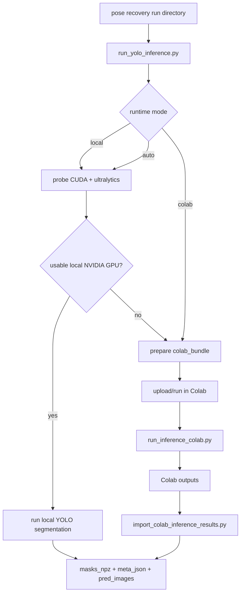

# Inference

[Previous: ROS Bag Preprocessing](02-rosbag-preprocessing.md) | [Back to index](README.md) | [Next: Camera-LiDAR Fusion](04-fusion.md)

## Purpose

This stage consumes the JPG frames exported from pose recovery and produces
Fusion-compatible segmentation outputs:

- `masks_npz/`
- `meta_json/`
- optional annotated images and combined class masks

## Primary Files

| File | Purpose |
| --- | --- |
| `fusion/run_yolo_inference.py` | Local-or-Colab inference dispatcher |
| `fusion/yolo_inference_common.py` | Shared bundle/export helpers |
| `fusion/colab/run_inference_colab.py` | Colab-side execution entrypoint |
| `fusion/import_colab_inference_results.py` | Copies Colab results back into the local run folder |

## Required Input Contract

The source pose-recovery run directory must contain:

- `images/`
- `image_timestamps.csv`

That contract is enforced by `resolve_pose_recovery_inputs()`.

## Flowchart: Inference Branching

## Runtime Modes

### `local`

Force local inference on the selected CUDA device.

### `auto`

Probe the local runtime and use the local GPU if available. Otherwise prepare a
Colab bundle.

### `colab`

Always prepare a Colab bundle and do not attempt local inference.

## Local Runtime Probe

`run_yolo_inference.py` checks:

- is `torch` installed?
- is `ultralytics` installed?
- is CUDA visible?
- does the selected device exist?
- is the device modern enough for the intended local path?

## Output Contract

For image `frame_000001.jpg`, inference must write:

- `frame_000001_masks.npz`
- `frame_000001_meta.json`

Fusion relies on this filename convention.

## Colab Bundle

The Colab bundle contains:

- `images/`
- `image_timestamps.csv`
- `colab_inference_config.json`
- `run_inference_colab.py`
- `yolo_inference_common.py`
- optionally bundled weights

After Colab runs, the same bundle root also contains:

- `pred_images/`
- `masks_npz/`
- `meta_json/`
- `combined_class_masks/`

## Assumptions And Invariants

- Image stems must remain unchanged from pose recovery through inference.
- Masks must stay pixel-aligned to the original JPGs.
- The output must describe instance masks, not just bounding boxes.
- The model weights must be for segmentation, not detection-only.

## Where To Change Behavior

| Goal | File to change |
| --- | --- |
| Change local-vs-Colab runtime logic | `fusion/run_yolo_inference.py` |
| Change bundle contents or output export behavior | `fusion/yolo_inference_common.py` |
| Change Colab-side runtime behavior | `fusion/colab/run_inference_colab.py` |
| Change how imported Colab results are validated/copied | `fusion/import_colab_inference_results.py` |

## Common Developer Tasks

### Swap YOLO weights

Change the `--weights` path or update the default candidate search locations.

### Force local GPU

Use:

- `--runtime local`
- `--local-device 0`

### Debug why auto mode fell back to Colab

Inspect the runtime probe result in `run_yolo_inference.py` and the generated
`inference_manifest.json`.

[Previous: ROS Bag Preprocessing](02-rosbag-preprocessing.md) | [Back to index](README.md) | [Next: Camera-LiDAR Fusion](04-fusion.md)
