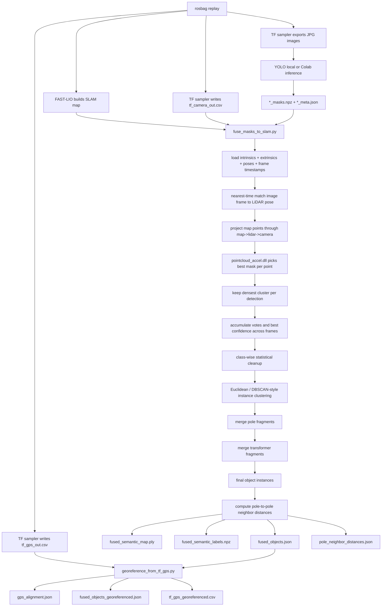

# Camera-LiDAR Fusion

[Previous: Inference](03-inference.md) | [Back to index](README.md) | [Next: GPS Georeferencing And Powerlines](05-georeferencing-and-powerlines.md)

## Purpose

This is the core semantic fusion stage. It takes:

- the SLAM cloud from FAST-LIO,
- time-matched LiDAR poses,
- camera intrinsics,
- LiDAR-camera extrinsics,
- per-image masks and metadata,

and turns them into 3D semantic object instances.

## Primary Files

| File | Purpose |
| --- | --- |
| `fusion/fuse_masks_to_slam.py` | Main fusion engine |
| `fusion/native/pointcloud_accel.cpp` | C++ projection kernel |
| `fusion/native/pointcloud_accel.py` | Python wrapper for the projection kernel |
| `fusion/native/build_accel.py` | DLL build helper |

## Supported Classes

Allowed by default:

- `pole`
- `crossarm`
- `transformer`
- `pedestal`
- `pedestal_box`
- `pedestal box`

Rejected by default:

- wire/powerline synonyms

## Flowchart: Camera-LiDAR Fusion

## Main Algorithm

### 1. Parse and normalize inputs

`fuse_masks_to_slam.py` loads:

- intrinsics
- extrinsics
- pose rows
- image timestamps
- frame records

### 2. Match images to poses

Every frame is paired with the nearest LiDAR pose in time.

### 3. Project map points into image masks

The hot path uses `pointcloud_accel.dll` to:

1. transform each map point into LiDAR coordinates,
2. transform the LiDAR point into camera coordinates,
3. project the point to pixel coordinates,
4. test the pixel against all allowed instance masks,
5. keep the highest-confidence allowed detection.

### 4. Dense-cluster cleanup

For each detection, the script keeps only the densest projected cluster to
remove sparse fragments before voting.

### 5. Cross-frame voting

The script keeps:

- vote count per point,
- best confidence per point,
- winning class per point.

### 6. Instance segmentation

The script performs class-wise segmentation using:

- statistical cleanup,
- Euclidean/DBSCAN-style clustering,
- XY-only clustering for poles,
- full-3D clustering for other classes.

### 7. Fragment merge passes

- poles are merged when XY boxes overlap
- transformers are merged when fragments appear attached to the same support
  pole and occupy the same local neighborhood

### 8. Pole-to-pole spacing

The final pole instances are analyzed to build a sparse neighbor graph and
measure pole spacing.

## Major Outputs

- `fused_semantic_map.ply`
- `fused_semantic_labels.npz`
- `fused_objects.json`
- `pole_neighbor_distances.json`

## Tuning Guide

| Parameter area | What it affects |
| --- | --- |
| `--allowed-classes`, `--reject-classes` | Which detections are even considered by Fusion |
| `--time-offset-sec` | Global image/pose timing alignment |
| `--min-vote-to-keep` | How much multi-frame support is required |
| `--eps-factor` | Clustering sensitivity |
| `--min-cluster-points` | Minimum viable instance size |
| `--stat-nb-neighbors`, `--stat-std-ratio` | Statistical outlier removal aggressiveness |
| pole spacing parameters | Which pole-to-pole edges are accepted |

## Assumptions And Invariants

- The JPG stem and inference-output stem must match exactly.
- Masks must correspond to the original image orientation.
- `tf_camera_out.csv` and `image_timestamps.csv` must share the same time basis.
- Intrinsics and extrinsics must refer to the same camera used to capture the
  image frames.

## Where To Change Behavior

| Goal | File to change |
| --- | --- |
| Change class allow/reject behavior | `fusion/fuse_masks_to_slam.py` |
| Change point-to-mask projection behavior | `fusion/native/pointcloud_accel.cpp` and wrapper |
| Change dense cluster cleanup | `keep_largest_dense_cluster()` in `fusion/fuse_masks_to_slam.py` |
| Change instance segmentation | `segment_class_instances()` in `fusion/fuse_masks_to_slam.py` |
| Change pole merge rules | `merge_pole_fragments()` in `fusion/fuse_masks_to_slam.py` |
| Change transformer merge rules | `merge_transformer_fragments()` in `fusion/fuse_masks_to_slam.py` |
| Change pole spacing logic | `compute_pole_neighbor_distances()` in `fusion/fuse_masks_to_slam.py` |

### Common Developer Tasks

#### Add a new object class

1. Add the class name to the allow-list or pass it in with `--allowed-classes`.
2. Make sure YOLO emits the same normalized class name.
3. Add a stable color if needed.
4. Decide whether the class needs special clustering or merge behavior.

#### Reduce over-segmentation

Start with:

- `--eps-factor`
- `--min-cluster-points`
- merge heuristics

#### Debug “no map points landed inside allowed masks”

Check:

- calibration,
- timestamp matching,
- image rotation,
- class allow/reject lists.

[Previous: Inference](03-inference.md) | [Back to index](README.md) | [Next: GPS Georeferencing And Powerlines](05-georeferencing-and-powerlines.md)
