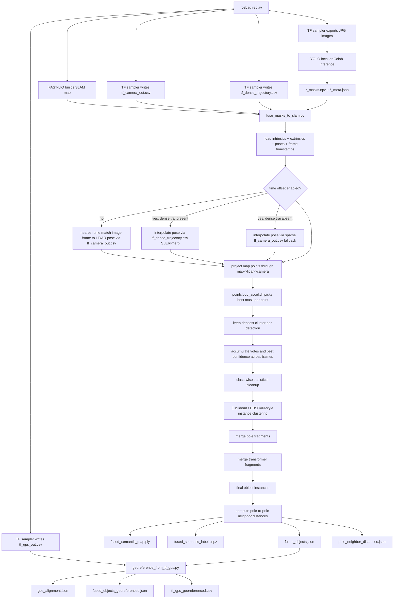

# Camera-LiDAR Fusion

[Previous: Inference](03-inference.md) | [Back to index](README.md) | [Next: GPS Georeferencing And Powerlines](05-georeferencing-and-powerlines.md)

## Purpose

This is the core semantic fusion stage. It takes:

- the SLAM cloud from FAST-LIO,
- time-matched LiDAR poses,
- camera intrinsics,
- LiDAR-camera extrinsics,
- per-image masks and metadata,

and turns them into 3D semantic object instances.

## Primary Files

| File | Purpose |
| --- | --- |
| `fusion/fuse_masks_to_slam.py` | Main fusion engine |
| `fusion/native/pointcloud_accel.cpp` | C++ projection kernel |
| `fusion/native/pointcloud_accel.py` | Python wrapper for the projection kernel |
| `fusion/native/build_accel.py` | DLL build helper |
| `fusion/tests/test_dense_trajectory.py` | Unit tests for the dense trajectory interpolation system |
| `fusion/sample_dense_trajectory.csv` | Schema reference for the dense trajectory CSV |

## Supported Classes

Allowed by default:

- `pole`
- `crossarm`
- `transformer`
- `pedestal`
- `pedestal_box`
- `pedestal box`

Rejected by default:

- wire/powerline synonyms

## Flowchart: Camera-LiDAR Fusion

## Pose-Lookup Paths

`fuse_masks_to_slam.py` has three distinct pose-lookup paths depending on whether
time-offset mode is enabled and whether a dense trajectory file is available.

Fusion object generation itself does not require GPS. GPS only matters for the
later georeferencing/export step that writes world-coordinate outputs.

### Path 1: No time offset (default)

When `--time-offset-enabled` is **not** passed:

- Calls `match_nearest_pose_indices()` against the sparse `--pose-csv`
  (`tf_camera_out.csv`).
- No time shift is applied — each frame is matched to the nearest recorded
  camera pose by absolute timestamp.
- The dense trajectory is not loaded at all.

### Path 2: Time offset enabled + dense trajectory present (preferred)

When `--time-offset-enabled` is passed and `--dense-traj-csv` points to a
valid `tf_dense_trajectory.csv`:

1. The dense trajectory is loaded once from CSV. Its `timestamp_sec` column is
   expected to be in the same unix/header time domain as
   `image_timestamps.csv:t_query_sec`.
2. Quaternion sign continuity is enforced globally across the full loaded
   sequence (`_enforce_quaternion_sign_continuity`). For every adjacent pair
   `(q[i-1], q[i])`, if `dot(q[i-1], q[i]) < 0` the sign of `q[i]` is
   flipped. This single O(N) pass ensures all subsequent per-frame SLERP calls
   always interpolate along the short arc, even across hemisphere crossings.
3. For each camera frame:
   - `t_query = frame.timestamp + time_offset_sec`
   - Binary-search the dense timestamps to find the bracketing pair
     `[T[left], T[right]]` around `t_query`.
   - `alpha = (t_query - T[left]) / (T[right] - T[left])`
   - Translation: linear lerp between the two bracketing translations.
   - Rotation: quaternion SLERP between the two bracketing orientations.
4. If `t_query` is outside `[T[0], T[-1]]`, the frame is dropped (`None` returned).
   If the dense trajectory is obviously in the wrong timestamp domain, Fusion
   now raises a targeted error and requires regenerated pose recovery outputs.
5. Diagnostics returned by `query_dense_trajectory()` use the same schema as the
   old `interpolate_pose_record()` — `match_mode`, `pose_index_lo/hi`,
   `pose_time_lo/hi`, `interp_alpha` — so the `used_frames` JSON output is
   fully schema-compatible with runs that used the old path.

### Path 3: Time offset enabled + no dense trajectory (fallback)

When `--time-offset-enabled` is passed but `--dense-traj-csv` is absent or the
file does not exist:

- Falls back to calling `interpolate_pose_record()` against the sparse
  `--pose-csv` trajectory.
- A warning is printed to the log.
- This matches the behavior before the dense trajectory was added, so existing
  outputs produced without `tf_dense_trajectory.csv` are not broken.

### Key dataclasses and functions

| Name | Location | Role |
| --- | --- | --- |
| `DenseTrajectory` | `fuse_masks_to_slam.py` | Frozen dataclass: `timestamps (N,)`, `translations (N,3)`, `quaternions (N,4)` |
| `load_dense_trajectory(path)` | `fuse_masks_to_slam.py` | Loads CSV, filters OK rows, validates quaternion norm, normalizes, sorts, deduplicates, enforces sign continuity |
| `_enforce_quaternion_sign_continuity(q)` | `fuse_masks_to_slam.py` | O(N) in-place sign flip pass |
| `query_dense_trajectory(traj, t_query)` | `fuse_masks_to_slam.py` | Binary search + lerp/SLERP; returns `(PoseRecord|None, diagnostics)` |

## Main Algorithm

### 1. Parse and normalize inputs

`fuse_masks_to_slam.py` loads:

- intrinsics
- extrinsics
- pose rows (sparse event-driven CSV)
- dense trajectory (when present and time-offset mode is active)
- image timestamps
- frame records

### 2. Match images to poses

Every frame is paired with a LiDAR pose using one of the three pose-lookup paths
described above. When time-offset mode is active and the dense trajectory is
present, `t_query = frame.timestamp + time_offset_sec` is interpolated directly
from the dense 10 ms grid via binary search and SLERP/lerp.

### 3. Project map points into image masks

The hot path uses `pointcloud_accel.dll` to:

1. transform each map point into LiDAR coordinates,
2. transform the LiDAR point into camera coordinates,
3. project the point to pixel coordinates,
4. test the pixel against all allowed instance masks,
5. keep the highest-confidence allowed detection.

### 4. Dense-cluster cleanup

For each detection, the script keeps only the densest projected cluster to
remove sparse fragments before voting.

### 5. Cross-frame voting

The script keeps:

- vote count per point,
- best confidence per point,
- winning class per point.

### 6. Instance segmentation

The script performs class-wise segmentation using:

- statistical cleanup,
- Euclidean/DBSCAN-style clustering,
- XY-only clustering for poles,
- full-3D clustering for other classes.

### 7. Fragment merge passes

- poles are merged when XY boxes overlap
- transformers are merged when fragments appear attached to the same support
  pole and occupy the same local neighborhood

### 8. Pole-to-pole spacing

The final pole instances are analyzed to build a sparse neighbor graph and
measure pole spacing.

## Major Outputs

- `fused_semantic_map.ply`
- `fused_semantic_labels.npz`
- `fused_objects.json`
- `pole_neighbor_distances.json`

## Tuning Guide

| Parameter area | What it affects |
| --- | --- |
| `--allowed-classes`, `--reject-classes` | Which detections are even considered by Fusion |
| `--time-offset-sec` | Global image/pose timing alignment shift applied before pose lookup |
| `--time-offset-enabled` | Activates the time-offset pose-lookup path (dense or sparse) |
| `--dense-traj-csv` | Path to `tf_dense_trajectory.csv`; enables high-accuracy interpolated pose lookup when time-offset is on |
| `--min-vote-to-keep` | How much multi-frame support is required |
| `--eps-factor` | Clustering sensitivity |
| `--min-cluster-points` | Minimum viable instance size |
| `--stat-nb-neighbors`, `--stat-std-ratio` | Statistical outlier removal aggressiveness |
| pole spacing parameters | Which pole-to-pole edges are accepted |

## Assumptions And Invariants

- The JPG stem and inference-output stem must match exactly.
- Masks must correspond to the original image orientation.
- `tf_camera_out.csv` and `image_timestamps.csv` must share the same time basis.
- Intrinsics and extrinsics must refer to the same camera used to capture the
  image frames.
- When `--dense-traj-csv` is supplied, the file must have been produced by the
  same preprocessing run as `tf_camera_out.csv` and `image_timestamps.csv`.
  Mixing outputs from different runs will produce misaligned poses.
- `tf_dense_trajectory.csv` must be sanitized before use (the preprocessing
  shell script calls `sanitize_pose_recovery_outputs.py` automatically). If you
  produce the file manually, run the sanitizer before passing it to Fusion.
- GPS georeferencing requires at least 3 usable `tf_gps_out.csv` rows after
  filtering. In the explicit developer mode for no-GPS bags, the GUI skips
  georeferencing and leaves the local-coordinate Fusion outputs in place.

## Where To Change Behavior

| Goal | File to change |
| --- | --- |
| Change class allow/reject behavior | `fusion/fuse_masks_to_slam.py` |
| Change point-to-mask projection behavior | `fusion/native/pointcloud_accel.cpp` and wrapper |
| Change dense cluster cleanup | `keep_largest_dense_cluster()` in `fusion/fuse_masks_to_slam.py` |
| Change instance segmentation | `segment_class_instances()` in `fusion/fuse_masks_to_slam.py` |
| Change pole merge rules | `merge_pole_fragments()` in `fusion/fuse_masks_to_slam.py` |
| Change transformer merge rules | `merge_transformer_fragments()` in `fusion/fuse_masks_to_slam.py` |
| Change pole spacing logic | `compute_pole_neighbor_distances()` in `fusion/fuse_masks_to_slam.py` |
| Change dense trajectory loading or quaternion normalization | `load_dense_trajectory()` in `fusion/fuse_masks_to_slam.py` |
| Change SLERP/lerp interpolation behavior | `query_dense_trajectory()` in `fusion/fuse_masks_to_slam.py` |
| Change quaternion sign continuity enforcement | `_enforce_quaternion_sign_continuity()` in `fusion/fuse_masks_to_slam.py` |

### Common Developer Tasks

#### Add a new object class

1. Add the class name to the allow-list or pass it in with `--allowed-classes`.
2. Make sure YOLO emits the same normalized class name.
3. Add a stable color if needed.
4. Decide whether the class needs special clustering or merge behavior.

#### Reduce over-segmentation

Start with:

- `--eps-factor`
- `--min-cluster-points`
- merge heuristics

#### Debug “no map points landed inside allowed masks”

Check:

- calibration,
- timestamp matching,
- image rotation,
- class allow/reject lists.

[Previous: Inference](03-inference.md) | [Back to index](README.md) | [Next: GPS Georeferencing And Powerlines](05-georeferencing-and-powerlines.md)
