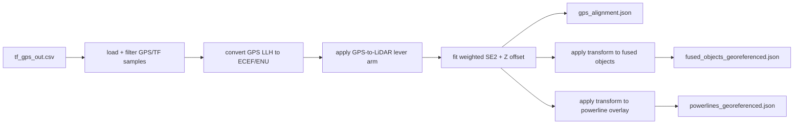

# GPS Georeferencing And Powerlines

[Previous: Camera-LiDAR Fusion](04-fusion.md) | [Back to index](README.md) | [Next: File Contracts](06-file-contracts.md)

## Purpose

This stage takes local-frame outputs and maps them into geographic coordinates.
It also adapts generated wire results into a portable overlay format.

## Primary Files

| File | Purpose |
| --- | --- |
| `fusion/georeference_from_tf_gps.py` | Fit local-to-GPS transform and apply it |
| `fusion/native/geospatial_accel.cpp` | Bulk transform kernel |
| `fusion/native/geospatial_accel.py` | Python wrapper for the geospatial DLL |
| `fusion/native/build_geospatial_accel.py` | DLL build helper |
| `fusion/export_powerlines_to_leaflet.py` | Powerline overlay adapter |

## Flowchart: GPS Georeferencing

## GPS Alignment Model

The alignment is not a general unconstrained 3D registration. It is:

- weighted SE(2) in the horizontal plane,
- plus a separate Z offset,
- with optional uniform XY scale.

This is a deliberate design choice because the underlying local map is expected
to already be metric and structurally rigid enough that yaw + translation
captures the dominant mapping from local frame to ENU.

## Data Sources

The georeferencing stage uses:

- `tf_gps_out.csv`
- optional GPS-to-LiDAR lever arm
- `fused_objects.json`
- optional powerline overlay JSON

## Powerline Export

`export_powerlines_to_leaflet.py` is an adapter, not a wire-extraction engine.

It consumes generated wire artifacts such as:

- `wires_points.npz`
- `wire_info.json`
- `ground_points.npz`

and emits a portable JSON record with:

- centroid
- polyline points
- fit metadata
- placeholder GPS fields

## Where To Change Behavior

| Goal | File to change |
| --- | --- |
| Change GPS fit model | `fusion/georeference_from_tf_gps.py` |
| Change native transform behavior | `fusion/native/geospatial_accel.cpp` |
| Change powerline export schema | `fusion/export_powerlines_to_leaflet.py` |

## Assumptions And Invariants

- `tf_gps_out.csv` rows must represent LiDAR poses sampled at GPS message times.
- The lever arm must use the same body-frame convention assumed by the source
  poses.
- The GPS fit assumes enough spatial diversity in the samples to solve the
  horizontal alignment robustly.

[Previous: Camera-LiDAR Fusion](04-fusion.md) | [Back to index](README.md) | [Next: File Contracts](06-file-contracts.md)
